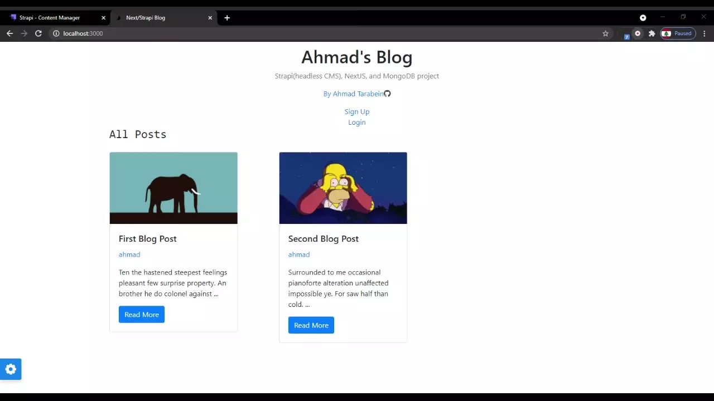

# Demo Video



A very basic blog built using Nextjs and Strapi headless CMS framework for backend management. I wasn't able to host the demo on a free hosting provider since the strapi and the nextjs are large to be hosted for free. You can still clone the project though :p

Features:

- User registeration using Strapi api
- User authentication using strapi locale methods(+JWT)
- Ability to add posts with categories and images
- nextjs server side rendering
- responsive

Conclusion: Strapi is cool to use for a quick API construction. I also liked the part in which user registration is done just by calling the api and strapi handles the rest. Overall it's good.

## Installation

```bash
git clone https://github.com/ahmadbenos/strapi-nextjs-blog.git
```

```bash
npm install
```

## Usage

1- **go to /config/database.js and enter your mongodb database info for this project to work on your pc**

2-

```bash
npm run dev
```

3- go to `localhost:3000`

## Contributing

Pull requests are welcome. For major changes, please open an issue first to discuss what you would like to change.

Please make sure to update tests as appropriate.

## License

[MIT](https://choosealicense.com/licenses/mit/)
